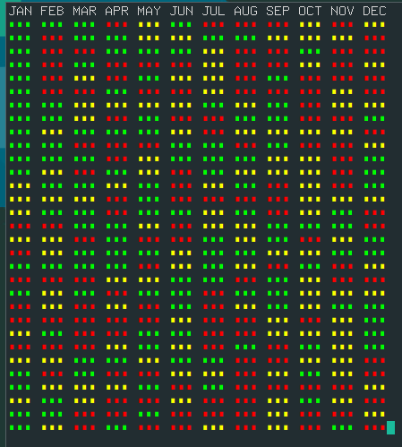

# year-in-colors
Map your mood to a color blocks in terminal

## Usage
1. Decide how was your day on a scale of 3.
2. Execute the script with integer representing your day. The script will record it.
3. You can also execute the script without any argument to print the color blocks till date.
4. For symmetry every month is considered to be of 31 days.

eg: python3 main.py 2

